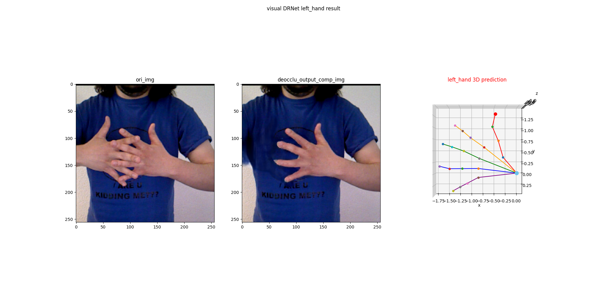
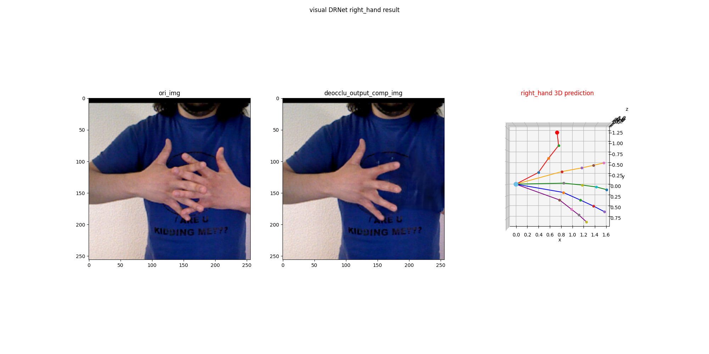

# 3D Interacting Hand Pose Estimation by Hand De-occlusion and Removal 
### [Arxiv](https://arxiv.org/abs/2207.11061) | [Website](https://menghao666.github.io/HDR/) | [Youtube](https://www.youtube.com/watch?v=Q8IViooXrwY) or [哔哩哔哩](https://www.bilibili.com/video/BV1LG4y1X7by/?share_source=copy_web&vd_source=b95f1bc03e231d9e795f5f04258584b8)) | [Poster](assets/6671.pdf)｜ [商汤学术](https://mp.weixin.qq.com/s/I6Kec-u5thvcXaxyfeXm_w)

>**3D Interacting Hand Pose Estimation by Hand De-occlusion and Removal**\
> <a href="https://menghao666.github.io/" target="_blank">Hao Meng</a><sup>1,3*</sup>,
<a href="https://jin-s13.github.io/" target="_blank">Sheng Jin</a><sup>2,3*</sup>,
<a href="https://scholar.google.com/citations?user=KZn9NWEAAAAJ&hl=en" target="_blank">Wentao Liu</a><sup>3,4</sup>,
<a href="https://scholar.google.com.hk/citations?user=AerkT0YAAAAJ&hl=en" target="_blank">Chen Qian</a><sup>3</sup>,
<a href="https://ieeexplore.ieee.org/author/37897574600" target="_blank">Mengxiang Lin</a><sup>1</sup>,
<a href="https://wlouyang.github.io/" target="_blank">Wanli Ouyang</a><sup>4,5</sup>,
<a href="http://luoping.me/" target="_blank">Ping Luo</a><sup>2</sup>,
\
>ECCV 2022

This repo contains code and AIH (Amodal Interacting Hand) dataset of our HDR work.


## Cleaning in progress
We are currently cleaning the code, so you may encounter runtime errors when running this repo.
The author is busy with other projects, and may not release the code soon. But the demo and the dataset could show you how the pipeline works.

## Installation
The `demo.py` has been tested on the following platform:
```
Python 3.7, PyTorch 1.8.0 with CUDA 11.6 and cuDNN 8.4.0, mmcv-full 1.3.16, mmsegmentation 0.18.0, Win10 Pro
``` 
We recommend to manage the dependencies using conda.
Please first install CUDA and ensure NVCC works. 
You can then create a conda environment using provided yml file as following:
```
conda env create -n hdr -f environment.yml
conda activate hdr
```

## Clone our repo
```
git clone https://github.com/MengHao666/HDR.git
cd HDR
```


## Explore our AIH dataset
Download it from [onedrive](https://connecthkuhk-my.sharepoint.com/:f:/g/personal/js20_connect_hku_hk/El9VswXHW35EocHo4ogpW5EBpzl3bZW7WoXoXeX3cEvcpw?e=M6gCIt), then extract all files.
Now your `AIH_dataset` folder structure should like this:
```
AIH_dataset/

    AIH_render/
        human_annot/
            train/
        machine_annot/
            train/
            val/
            
    AIH_syn/
        filtered_list/
        human_annot/
            train/
            test/
        machine_annot/
            train/
            val/
            test/
        syn_cfgs/
        
```
you could run `python explore_AIH.py` to explore our AIH dataset.Please modify the `AIH_root` in the code.

## Demo
Download our pretrained models from [Google Drive](https://drive.google.com/file/d/11kGAz_qpvHj15tozcWZhbC_Dbgj5FKBu/view?usp=sharing) 
into `HDR` file directory, then extract all files inside.
Now your `demo_work_dirs` folder structure should like this:
```
HDR/
    ...
    
    demo_work_dirs/
    
        All_train_SingleRightHand/
            checkpoints/
                ckpt_iter_261000.pth.tar
                
        Interhand_seg/
            iter_237500.pth
            
        TDR_fintune
            checkpoints/
                ckpt_iter_138000.pth.tar
                D_iter_138000.pth.tar
        
        
```

You could run `python demo/demo.py` to see how our pipeline works. Note you may need to modify the full path of `HDR` in line 5 as we tested in Win10 Pro.

The results of **HDR+SHPE** are like following:



## Citation
```
@article{meng2022hdr,
  title={3D Interacting Hand Pose Estimation by Hand De-occlusion and Removal},
  author={Hao Meng, Sheng Jin, Wentao Liu, Chen Qian, Mengxiang Lin, Wanli Ouyang, and Ping Luo},
  booktitle={European Conference on Computer Vision (ECCV)},
  year={2022}
  month={October},
}
```
## Acknowledgements
The code is built upon following works:
- [Minimal-Hand-pytorch](https://github.com/MengHao666/Minimal-Hand-pytorch)
- [deocclusion](https://github.com/XiaohangZhan/deocclusion/)
- [mmsegmentation](https://github.com/open-mmlab/mmsegmentation)
- [PVT_v2](https://github.com/whai362/PVT/blob/v2/detection/pvt_v2.py)
- [InterHand2.6M](https://github.com/facebookresearch/InterHand2.6M)

## License
HDR (including AIH dataset) is CC-BY-NC 4.0 licensed, as found in the LICENSE file.
